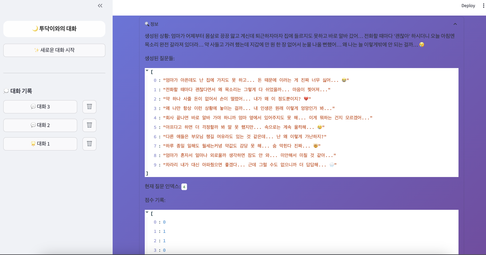
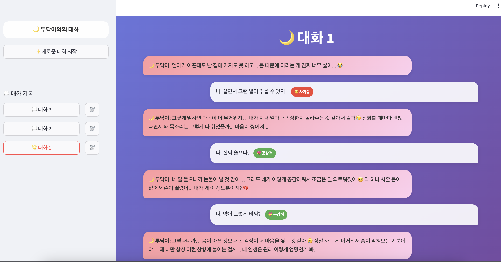
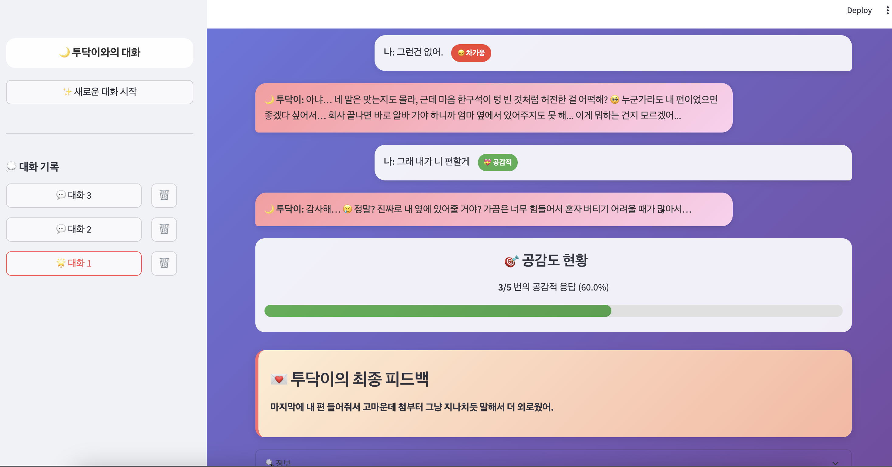

# 나 T나??

## 1.Pipeline
`main.py`

 

## 2. API
- FastAPI
- Build Docker Image

 
<!-- 
## 3. TEST
-  test1
    - 사전 상황 정의 x
    - 대화 흐름대로 이어나가기
    - 점수 부여
    - 최종 피드백

 

-  test2(`test/test2.ipynb`)
    - 사전 상황 정의 o
    - 문제 10개 생성
    - 점수 부여
    - 최종 피드백

 
 -->

## 3. TEST sample (`app_mock.py`)
- 상황 및 문제

 

- 대화 흐름

## 4. To-Do
1. AI
- 성능 → 논의 후 방향 잡기
- log 추가
- 예외처리

2. API swagger

3. Docker

4. 배포