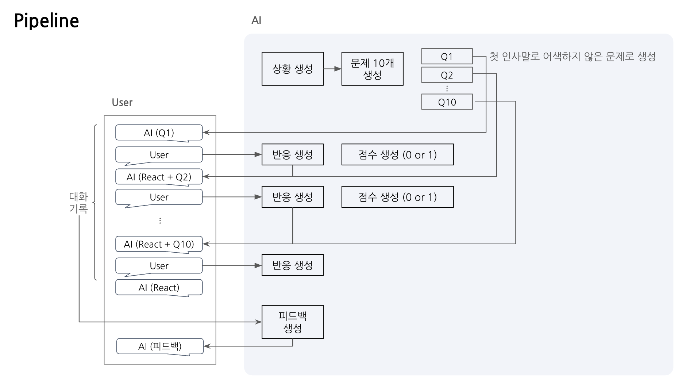

# 나 T나??

## 1.Pipeline
`main.py`

<br>



<br>

## 2. API
### API swagger
- `/situation`

```
{
    "user_id":"",
    conversation = []
}
```

- `/conversation`
```
{
    "user_id":"",
    conversation = [],
    questions = []
}
```

- `/feedback`
```
{
    "user_id":"",
    conversation = [],
}
```

<br>

---
- FastAPI
- Build Docker Image

<br>
<!-- 
## 3. TEST
-  test1
    - 사전 상황 정의 x
    - 대화 흐름대로 이어나가기
    - 점수 부여
    - 최종 피드백

<br>

-  test2(`test/test2.ipynb`)
    - 사전 상황 정의 o
    - 문제 10개 생성
    - 점수 부여
    - 최종 피드백

<br>
 -->

## 3. TEST sample (`app_mock.py`)
- 상황 및 문제

<br>

- 대화 흐름


## 4. To-Do
1️⃣ AI
- [ ] Clova model test 
    - [✔️] <sub><del>각 태스크 별 프롬프팅</del></sub>  
    - [ ] TPS  
    - [ ] Langsmith
- [✔️] <sub><del>파이프라인 설계</del></sub>  
- [ ] 성능(만족도) → 논의 후 방향 잡기
- [ ] Debugging
- [ ] Exception Handling

2️⃣ API swagger

3️⃣ Docker Images build

4️⃣ 배포
- [ ] AWS에 배포
- [ ] TEST