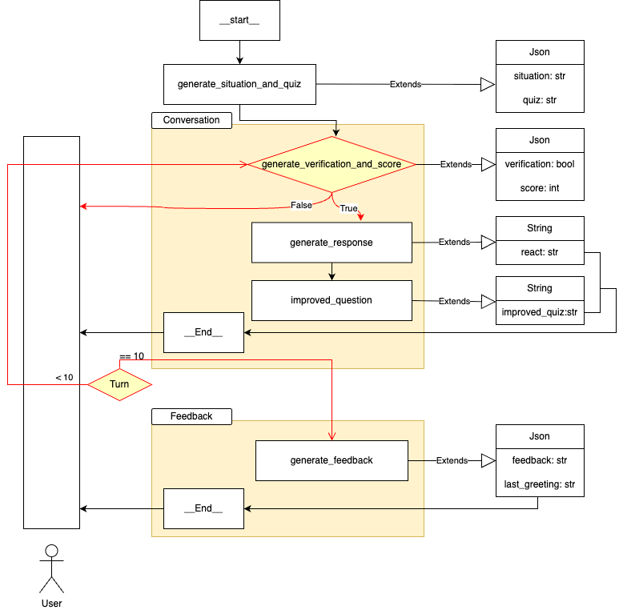
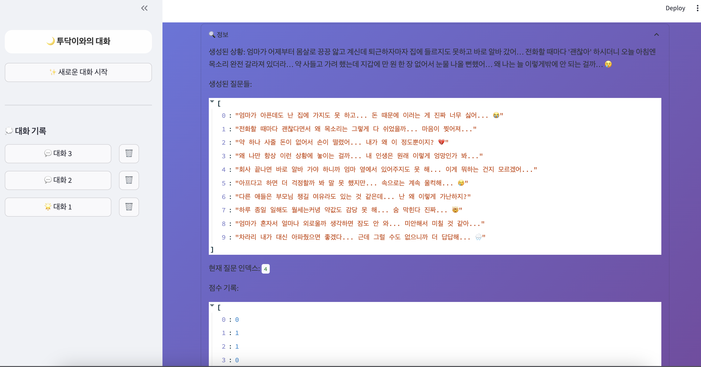
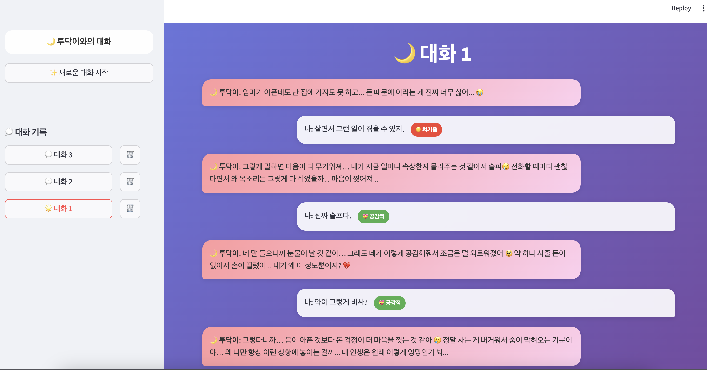
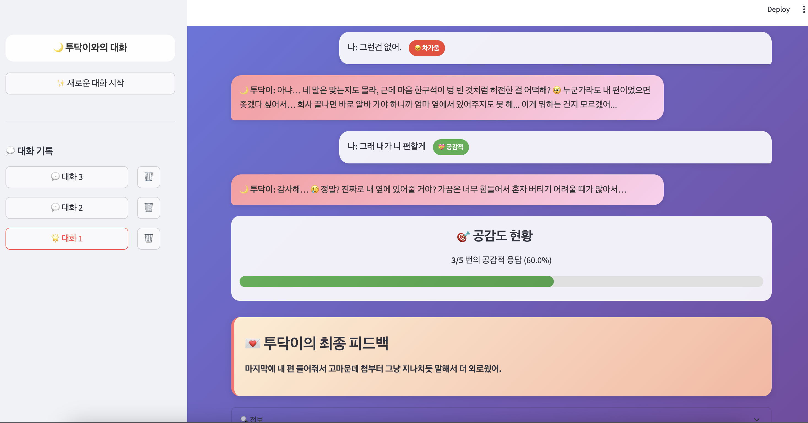

# 나 T나??
> T 성향을 가진 사람들이 감정 공감을 훈련해볼 수 있는 AI 챗봇 기반의 감정 시뮬레이션 서비스


<br>

### 🗒️ [Notion](https://ubiquitous-blackberry-1d3.notion.site/2483cff2c9eb805eb6edc5cc93cf8e2b?pvs=74) | 🤖 [Github](https://github.com/besides-508-potenday)

---
## 1.파이프라인
```
natna/
├── config
│     └── params.yaml
├── logs
├── __init__.py
├── app.py
├── chat.py
├── docker-compose.yml
├── Dockerfile
├── main.py
├── nginx.conf
├── poetry.lock
└── pyproject.toml
```

- AI Pipeline

     

- Output

    

### CLOVA 활용
1. HyperClova X
    > model name: HCX-007

<br>

2. CLOVA Voice (TTS)
    > Voice: 멍멍이\
    > 음색 : 2\
    > 높낮이 : 1

    <audio controls>
    <source src="data/tudak_voice.mp3.mp3" type="audio/mpeg">
    브라우저가 오디오 태그를 지원하지 않습니다.
    </audio> 

<br>

## 2. API
### [API swagger](https://www.notion.so/API-swagger-AI-BE-2453cff2c9eb80c18ed8d7dfc294b557)


<br>

- [✔️] FastAPI
- [✔️] Build Docker Image
- [✔️] Deploy to AWS 

<br>
<!-- 
## 3. TEST
-  test1
    - 사전 상황 정의 x
    - 대화 흐름대로 이어나가기
    - 점수 부여
    - 최종 피드백

<br>

-  test2(`test/test2.ipynb`)
    - 사전 상황 정의 o
    - 문제 5개 생성
    - 점수 부여
    - 최종 피드백

<br>
 -->
<!-- 
## 3. TEST sample (`app_mock.py`)
- 상황 및 문제

<br>

- 대화 흐름




## 4. To-Do
1️⃣ AI
- [✔️] Clova model test 
    - [✔️] 각 태스크 별 프롬프팅
    - [✔️] TPS  
- [✔️] 파이프라인 설계  
- [ ] 성능(만족도) → 논의 후 방향 잡기
- [✔️] Debugging
- [✔️] Exception Handling

2️⃣ API swagger

3️⃣ Docker Images build

4️⃣ 배포
- [ ] AWS에 배포
- [ ] TEST -->