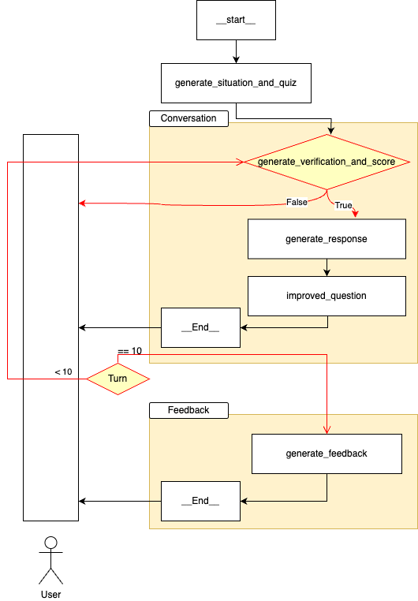

# 나 T나??
> T 성향을 가진 사람들이 감정 공감을 훈련해볼 수 있는 AI 챗봇 기반의 감정 시뮬레이션 서비스


> 채팅대화 시연

https://github.com/user-attachments/assets/8ab339ad-0bf5-4a8a-9a53-3c7d7342cde3

<br>

### 🗒️ [Notion](https://ubiquitous-blackberry-1d3.notion.site/2483cff2c9eb805eb6edc5cc93cf8e2b?pvs=74) | 🤖 [Github](https://github.com/besides-508-potenday)

---
## 1. Architecture
### Tech
<p>


</p>

```
natna/
├── config
│     └── params.yaml
├── conversation_logs
├── __init__.py
├── app.py
├── chat.py
├── docker-compose.yml
├── Dockerfile
├── main.py
├── nginx.conf
├── poetry.lock
├── pyproject.toml
└── s3_utils.py
```

### AI Pipeline
 

### AI Architecture
 


## 2. CLOVA 활용
### 1) HyperClova X
> model name: HCX-007

- `chat.py` flow
- 프롬프트는 코드 참고

 


<br>

### 2) CLOVA Voice (TTS)

> Voice: 멍멍이\
> 음색 : 2\
> 높낮이 : 1

<div align="center">

<table>
<tr>
<td>
<a href="https://github.com/besides-508-potenday/na-T-na-AI/tree/main/data/tudak_voice.mp3">

</a>
<br/>
</td>
</td>
</tr>
</table>

</div>

<br>

## 3. API
### [API swagger](https://www.notion.so/API-swagger-AI-BE-2453cff2c9eb80c18ed8d7dfc294b557)


<br>

- [✔️] FastAPI
- [✔️] Build Docker Image
- [✔️] Deploy to AWS 

<br>
<!-- 
## 3. TEST
-  test1
    - 사전 상황 정의 x
    - 대화 흐름대로 이어나가기
    - 점수 부여
    - 최종 피드백

<br>

-  test2(`test/test2.ipynb`)
    - 사전 상황 정의 o
    - 문제 5개 생성
    - 점수 부여
    - 최종 피드백

<br>
 -->
<!-- 
## 3. TEST sample (`app_mock.py`)
- 상황 및 문제

<br>

- 대화 흐름


## 4. To-Do
1️⃣ AI
- [✔️] Clova model test 
    - [✔️] 각 태스크 별 프롬프팅
    - [✔️] TPS  
- [✔️] 파이프라인 설계  
- [ ] 성능(만족도) → 논의 후 방향 잡기
- [✔️] Debugging
- [✔️] Exception Handling

2️⃣ API swagger

3️⃣ Docker Images build

4️⃣ 배포
- [ ] AWS에 배포
- [ ] TEST -->